```mermaid
classDiagram 
  direction LR

    %% ---------- Generic contracts ----------
    class IBaseRepository~T~ {
        <<interface>>
        +AddAsync(T value)
        +DeleteAsync(Guid id)
        +GetAllAsync() List~T~
        +GetByIdAsync(Guid id) T
    }
    class IReceiveService~T~ {
        <<interface>>
        +GetAllAsync() List~T~
        +GetByIdAsync(Guid id) T
    }
    class IAddService~T~ {
        <<interface>>
        +AddAsync(T value)
    }
    class IUpdateService~T~ {
        <<interface>>
        +UpdateAsync(T value)
    }
    class IDeleteService {
        <<interface>>
        +DeleteAsync(Guid id)
    }

    %% ---------- Data layer ----------
    class StudentAdministrationDbContext {
        +DbSet~Student~ Students
        +DbSet~Course~ Courses
        +DbSet~Grade~ Grades
        +DbSet~DegreeProgram~ DegreePrograms
        +DbSet~University~ Universities
    }

    class IStudentRepository {
        <<interface>>
        +UpdateAsync(Student value)
    }
    class IGradeRepository {
        <<interface>>
        +GetByStudentIdAsync(Guid id) List~Grade~
        +UpdateAsync(Grade value)
    }
    class ICourseRepository {
        <<interface>>
    }
    class IDegreeProgramRepository {
        <<interface>>
    }
    class IUniversityRepository {
        <<interface>>
    }

    class StudentRepository
    class CourseRepository
    class GradeRepository
    class DegreeProgramRepository
    class UniversityRepository

    IBaseRepository <|-- IStudentRepository
    IBaseRepository <|-- ICourseRepository
    IBaseRepository <|-- IGradeRepository
    IBaseRepository <|-- IDegreeProgramRepository
    IBaseRepository <|-- IUniversityRepository

    IStudentRepository <|.. StudentRepository
    ICourseRepository <|.. CourseRepository
    IGradeRepository <|.. GradeRepository
    IDegreeProgramRepository <|.. DegreeProgramRepository
    IUniversityRepository <|.. UniversityRepository

    StudentRepository ..> StudentAdministrationDbContext : uses
    CourseRepository ..> StudentAdministrationDbContext : uses
    GradeRepository ..> StudentAdministrationDbContext : uses
    DegreeProgramRepository ..> StudentAdministrationDbContext : uses
    UniversityRepository ..> StudentAdministrationDbContext : uses

    %% ---------- Service layer ----------
    class IStudentService {
        <<interface>>
        +GetAllStudentListModels() ObservableCollection~StudentListModel~
    }
    class ICourseService {
        <<interface>>
        +GetCoursesByDegreeProgramID(Guid id) List~CourseBindingModel~
    }
    class IGradeService {
        <<interface>>
        +GetByStudentIdAsync(Guid id) List~GradeBindingModel~
    }
    class IDegreeProgramService {
        <<interface>>
        +GetAllDegreeProgramListModels() ObservableCollection~DegreeProgramListModel~
    }
    class IUniversityService {
        <<interface>>
    }

    class StudentService
    class CourseService
    class GradeService
    class DegreeProgramService
    class UniversityService

    IReceiveService <|-- IStudentService
    IAddService <|-- IStudentService
    IUpdateService <|-- IStudentService
    IDeleteService <|-- IStudentService
    IReceiveService <|-- ICourseService
    IReceiveService <|-- IGradeService
    IAddService <|-- IGradeService
    IUpdateService <|-- IGradeService
    IDeleteService <|-- IGradeService
    IReceiveService <|-- IDegreeProgramService
    IReceiveService <|-- IUniversityService

    IStudentService <|.. StudentService
    ICourseService <|.. CourseService
    IGradeService <|.. GradeService
    IDegreeProgramService <|.. DegreeProgramService
    IUniversityService <|.. UniversityService

    StudentService ..> IStudentRepository : uses
    CourseService ..> ICourseRepository : uses
    GradeService ..> IGradeRepository : uses
    GradeService ..> ICourseService : uses
    DegreeProgramService ..> IDegreeProgramRepository : uses
    UniversityService ..> IUniversityRepository : uses
```

# Student Administration


A cross-platform **.NET MAUI** application for managing students, grades, degree programs and universities. The application is split into a clean, multi-layered architecture (data access, services, UI) and uses Entity Framework Core for persistence.


## Table of Contents

- [About the Project](#about-the-project)
- [Demo](#demo)
- [Features](#features)
- [Tech Stack](#tech-stack)
- [Architecture](#architecture)
- [Prerequisites](#prerequisites)
- [Project Structure](#project-structure)


## About the Project

Student Administration lets you create, edit, filter and delete students, record grades for courses and calculate the grade average. The UI supports multiple languages via localized resources.

This application was built for practice purposes, in order to internalize working with a multi-layered architecture and Entity Framework.

---


## Demo Play Video

<p align="center">
  <a href="https://youtu.be/iz5YZ8q-z4g">
    
  </a>
</p>

## Features

- Create, edit and delete students (CRUD)
- Filter students by ID, first/last name and degree program
- Record grades for courses and calculate the grade average
- Management of degree programs and universities
- Multilingual user interface (localization via `.resx`)
- Structured logging with Serilog (daily rolling log files)
- MVVM architecture using the CommunityToolkit

---

## Tech Stack

| Area | Technology |
|---|---|
| Framework | .NET 9.0 / .NET MAUI |
| Data access | Entity Framework Core 9 (SQL Server / SQLite) |
| MVVM | CommunityToolkit.Mvvm |
| UI components | CommunityToolkit.Maui, Syncfusion.Maui |
| Logging | Serilog |
| Tests | xUnit|

---

## Architecture

The project follows a multi-layered architecture with dependency injection (registered in `MauiProgram.cs`) and the repository pattern for data access.

```
StudentAdministration.UI         →  .NET MAUI app (views, view models, DI setup)
        │
        ▼
StudentAdministrationServices    →  Business logic, binding/list models
        │
        ▼
StudentAdministrationDatabase    →  EF Core DbContext, models, repositories
```

`StudentAdministration.UnitTests` tests the service and repository layers using mock repositories.

---

## Prerequisites

- [.NET 9 SDK](https://dotnet.microsoft.com/download)
- .NET MAUI workload:
  ```bash
  dotnet workload install maui
  ```
- Visual Studio 2022 (with the ".NET Multi-platform App UI development" workload) or VS Code with the .NET MAUI setup
- For SQL Server: a reachable SQL Server instance (local or LocalDB)
- A valid **Syncfusion license key** (see [Configuration](#configuration))

---


## Project Structure

```
.
├── StudentAdministration.UI/            # MAUI app: views, view models, MauiProgram.cs
├── StudentAdministrationServices/       # Services + binding/list models
├── StudentAdministrationDatabase/       # DbContext, models, repositories, sample data
└── StudentAdministration.UnitTests/     # Unit tests with mock repositories
```

---
